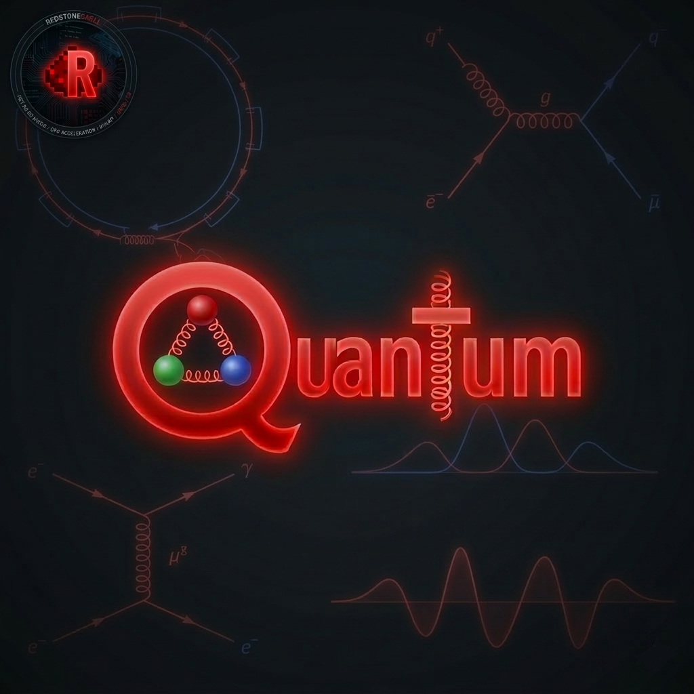

# Quantum
The newest PID-controller with Quantium-chromodynamic algorithm, to making step at one quark.
Used a Gell-Mann, Runge-Kutta 4, Struct Constants SU(3), Higgs Field/Mechanism, algorithms to work.
Maked for all peoples and corporations. Cool using

## How it works?
Is a very hard algorithm with highest physics and mathematic formulas, but if simple all is works on theese steps:
  1. INPUT → Your error signal becomes a COLOR VECTOR (Red, Green, Blue = RGB quark state)
  2. QUARK PROCESSING → QuarkPIDControllerRK4 kicks in
  3. __Multiplies by Gell-Mann matrices (SU(3) magic)
  4. __Adds gluon field interactions
  5. __Applies Higgs mass correction
  6. __Injects quantum fluctuations (real ħ noise)
  3. RK4 INTEGRATION → 4th order Runge-Kutta 
  1. __k₁ = derivative at start
  2. __k₂ = derivative at midpoint
  3. __k₃ = another midpoint derivative
  4. __k₄ = derivative at end
  5. __Combines them with 1/6, 1/3, 1/3, 1/6 weights
  4. OUTPUT → New color vector = movement of 1 QUARK (that's 0.000000000000000001 meters)

In 1 second this PID controller step 18,548,481,555,884,027,931,147,249,366,849,338,683,682,089 steps
or 1.85 × 10⁴³ steps

!WARNING!: Accuracy changes by motor types!!!!!

## How to use?
Go to folder "Examples". In this folder u found a need parts of code

# Features
  1. Accuracy                1 quark
  2. Step                    18 quintillion steps/s (with normal CUDA optimization and powerful CPU)
  3. For all motors          DC, Servo, Stepper, Vibrators
  4. Accessiblity            .NET 3.5 in all old PC, and new (if install, but works in .NET 3.5+)
  5. Correctable             Gell-Mann matrixeі is correct

# NOT Features
  1. Framework               Too old .NET but GC not destroy algorithm
  2. Resources               Have a very high count of "for" cycles in 4D dimension
